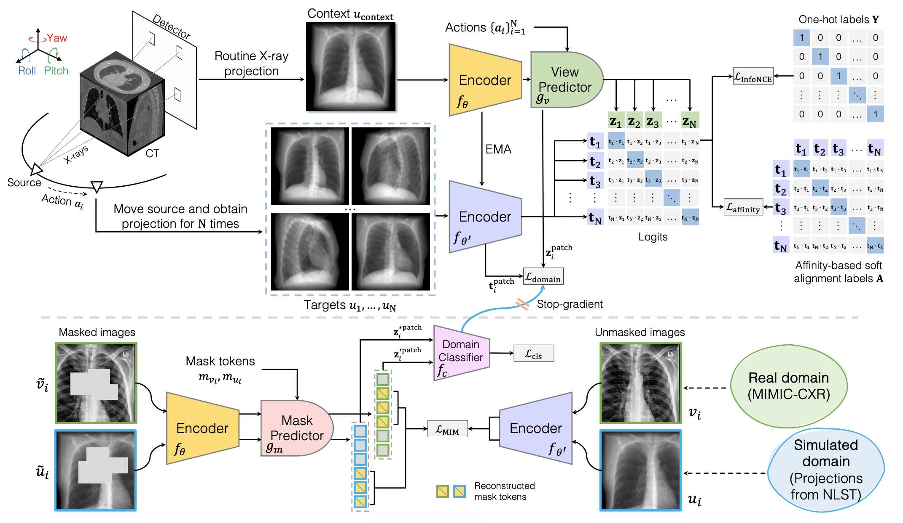

## X-ray World Intelligence Network (X-WIN)
Source code for the X-WIN work published in CVPR 2026. X-WIN is designed for chest X-ray representation learning. [[arXiv]](https://arxiv.org/abs/2511.14918)



## Data Preparation
The code for cone-beam X-ray projection generation is written in [generate_conebeam.py](data/generate_conebeam.py).


DRR images for pretraining are listed in a text file as follows:
```
/path/to/drrs/100005_T0_1.2.840.113654.2.55.330656333774433317291205463243337143455_0.jpg
/path/to/drrs/100005_T0_1.2.840.113654.2.55.330656333774433317291205463243337143455_10.jpg
/path/to/drrs/100005_T0_1.2.840.113654.2.55.330656333774433317291205463243337143455_15.jpg
/path/to/drrs/100005_T0_1.2.840.113654.2.55.330656333774433317291205463243337143455_20.jpg
/path/to/drrs/100005_T0_1.2.840.113654.2.55.330656333774433317291205463243337143455_25.jpg
...
```

Chest X-rays in MIMIC-CXR are listed in a text file as follows:
```
/path/to/mimic/mimic_000000.jpg
/path/to/mimic/mimic_000001.jpg
/path/to/mimic/mimic_000002.jpg
/path/to/mimic/mimic_000003.jpg
/path/to/mimic/mimic_000004.jpg
...
```

## Pretraining
Run the model pretraining with this bash script [train.sh](scripts/train.sh). Modify the output directory  `outdir` and text files `train_txt`, `train_real_txt`, etc. to your local paths.
```bash
export PYTHONPATH=.
export CUDA_VISIBLE_DEVICES=0,1,2,3

outdir="/fast/yangz16/outputs/x-win/vitbase_nlstdrr_mimic"
logdir="$outdir/log"

if [[ ! -d "$outdir" ]]; then
  mkdir -p "$outdir"
  echo "Created directory: $outdir"
else
  echo "Directory already exists: $outdir"
fi

torchrun --nproc_per_node=4 train.py \
--warmup 10 \
--epochs 100 \
--bs 24 \
--train_txt /fast/yangz16/outputs/x-win/train_drrs3.txt \
--test_txt /fast/yangz16/outputs/x-win/test_drrs3.txt \
--train_real_txt /fast/yangz16/outputs/x-win/train_mimic.txt \
--test_real_txt /fast/yangz16/outputs/x-win/test_mimic.txt \
--loss_type contrastive \
--contrastive_temp 0.1 \
--recon_weight 1.0 \
--outdir "$outdir" \
&> "$logdir" &
```

## Requirements
This codebase runs on `Python 3.8.20`.
Requirements:
```
torch==2.4.1
torchvision==0.19.1
numpy==1.24.3
pillow==10.4.0
matplotlib==3.7.5
diffdrr==0.5.1
fvcore==0.1.5.post20221221
ptflops==0.7.3
```

## Citation
```bibtex
@article{yang2025x,
  title={X-WIN: Building Chest Radiograph World Model via Predictive Sensing},
  author={Yang, Zefan and Wang, Ge and Hendler, James and Kalra, Mannudeep K and Yan, Pingkun},
  journal={arXiv preprint arXiv:2511.14918},
  year={2025}
}
